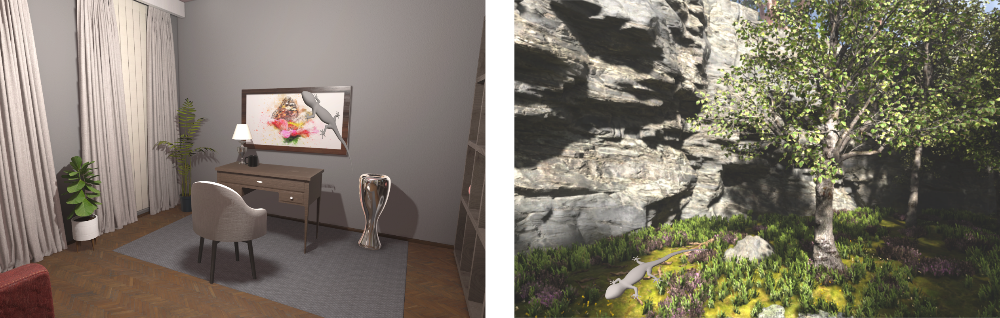

# Human-Aligned Color Constancy Model

**Transfer learning code and dataset for:**

> **Human-aligned evaluation of a pixel-wise DNN color constancy model**
> Hamed Heidari-Gorji, Raquel Gil Rodriguez, Karl R. Gegenfurtner
> *Frontiers in Human Neuroscience*, 2026
> DOI: [10.3389/fnhum.2026.1809976](https://doi.org/10.3389/fnhum.2026.1809976)

---

## Overview

Color constancy is the ability to perceive stable surface colors despite changes in illumination. This repository provides the code and dataset used to fine-tune a pixel-wise deep neural network (DNN) color constancy model on photorealistic virtual reality (VR) scenes, as described in the paper above.

Rather than evaluating the model against physical ground truth, this work assesses whether the model reproduces the structure of **human behavioral responses** across controlled manipulations of color constancy cues. The model is evaluated using the same achromatic object selection task used in the human psychophysical experiments.

### What was done

The model is a **ResNet-50 based U-Net** that takes an RGB image as input and outputs pixel-wise surface reflectance in CIELAB color space. The encoder was pre-trained on a synthetic rendered dataset (Heidari-Gorji and Gegenfurtner, 2023). In this work, **transfer learning** was applied: the encoder weights were frozen and only the decoder was fine-tuned using VR baseline condition images from two scenes (indoor and outdoor), each rendered under five chromatic illuminants.

To compare the model with human observers, the same achromatic lizard selection task was replicated: competitor lizard colors were passed through the model, reflectance values were extracted per competitor, and the model's inferred match was derived using projection and interpolation in CIELAB space. This yields a model Color Constancy Index (CCI) directly comparable to the human CCI.

### Dataset

The dataset consists of photorealistic VR scenes rendered in Unreal Engine, covering two environment types.



**Indoor** scenes feature an office-like room with a single point light source. **Outdoor** scenes feature a natural landscape with directional sunlight and skylight. Each scene contains an achromatic lizard as the reference object.

Each scene was rendered under **five chromatic illuminants**: neutral, red, green, blue, and yellow.


The dataset includes the illuminated input images, ground-truth reflectance images (rendered under neutral D65 illuminant), and segmentation masks for the target objects.

### Results

Under baseline conditions (all cues available), the model achieved high color constancy in both indoor and outdoor scenes, closely matching human observer performance. When individual cues were selectively removed, the model showed condition-dependent performance declines that mirrored human behavior:

- **Local surround** removal reduced constancy for both humans and the model in both scenes.
- **Spatial mean** manipulation (changing reflectances) produced the largest drops in both humans and the model.
- **Maximum flux** had comparatively modest effects in both groups.

The model's normalized concordance correlation coefficient (ncCCC) with human data was **1.10**, meaning the model predicted mean human responses more consistently than individual human observers agreed with each other. This substantially outperformed all six classical and deep learning baseline algorithms tested (Gray World, White Patch, Shades of Gray, Gray Edge, Weighted Gray Edge, Mixed Illuminant CNN).

### Why this model aligns with human perception

Most color constancy algorithms work by first estimating the scene illuminant and then applying a chromatic correction. Human observers, however, exhibit good color constancy while being poor at explicitly estimating the illuminant. This dissociation suggests that human constancy does not rely on explicit illuminant recovery.

The proposed model takes a different approach: it **directly predicts surface reflectance at each pixel**, without an intermediate illuminant estimation step. The U-Net architecture combines local and global chromatic information through skip connections at multiple spatial scales, enabling context-dependent integration of color cues that mirrors the relational processing observed in human vision.

The **Perceptual Balanced Color Loss (PBCLoss)** further aligns training with human perception by combining CIEDE2000 (a perceptually uniform color difference metric) with a chroma-weighted term that prevents the model from learning trivially desaturated outputs by placing higher penalties on saturated, perceptually important pixels.

The result is a model that not only matches human performance levels under normal conditions, but also reproduces the **structured, cue-dependent degradations** observed when specific mechanisms are silenced, a property that global-statistics-based algorithms fail to capture.

---

## Repository Structure

```
.
├── fine_tune.py        # Main training script
├── model.py            # UNetWithResnet50Encoder architecture
├── datasetImage.py     # ColorConstancyDataset (loads indoor + outdoor LAB data)
├── transforms.py       # Data augmentation transforms
├── loss.py             # PBCLoss (CIEDE2000 + chroma-weighted + L* terms)
├── util.py             # Logger: training log, checkpoint saving, image visualization
├── pretrained_weight/
│   └── model_weights.pth   # Pre-trained weights (download from Releases)
└── dataset/
    ├── indoor448/
    │   └── Control1/
    │       ├── img/    # Input images (sRGB)
    │       ├── gt/     # Ground truth reflectance images (sRGB)
    │       └── seg/    # Segmentation masks
    └── outdoor448/
        └── Control/
            ├── img/
            ├── gt/
            └── seg/
```

### File descriptions

**`fine_tune.py`** — Main entry point. Loads the pre-trained weights, freezes the first six encoder blocks, and fine-tunes the decoder on the VR baseline dataset. Logs loss, saves checkpoints every 200 epochs, and saves sample output images.

**`model.py`** — Defines `UNetWithResnet50Encoder`: a ResNet-50 encoder with skip connections feeding into a decoder built from transposed convolution blocks. Takes 3-channel RGB input, outputs 3-channel CIELAB reflectance maps.

**`datasetImage.py`** — Defines `ColorConstancyDataset`. Loads paired images from two directories (indoor and outdoor), converts ground truth from sRGB to normalized CIELAB, and returns `(index, filename, image, gt, seg)`.

**`transforms.py`** — Three-input transforms (`Compose3`, `ToTensor3`, `RandomCrop3`, `RandomHorizontalFlip3`, `RandomVerticalFlip3`, `RandomRotationWithCropAndResize3`) operating on `(image, gt, seg)` triplets simultaneously.

**`loss.py`** — Implements `PBCLoss`: a composite perceptual loss combining vectorised CIEDE2000, a chroma-weighted squared error on the a\*b\* channels, and an L\* squared error term.

**`util.py`** — `Logger` class: creates a timestamped results folder, writes training logs to disk, saves visualizations of input/target/output in CIELAB, and saves model checkpoints.

---

## Installation

```bash
pip install torch torchvision colour-science scikit-image matplotlib numpy Pillow tqdm
```

Tested with Python 3.10 and PyTorch 2.x.

---

## Usage

**1. Download weights and dataset** from the [Releases](../../releases) page and place them as shown in the directory structure above.

**2. Run fine-tuning:**

```bash
python fine_tune.py
```

Training runs for 4000 epochs. Checkpoints are saved every 200 epochs under `results/<timestamp>/checkpoints/`. Sample output images are saved each epoch.

**Key hyperparameters** (top of `fine_tune.py`):

| Parameter | Value | Description |
|---|-------|---|
| `learning_rate` | 1e-3  | Adam optimizer LR |
| `batch_size` | 16    | Training batch size |
| `step_size` | 200   | LR scheduler step size (epochs) |
| `gamma` | 0.8   | LR decay factor per step |
| `n_classes` | 3     | Output channels (L\*, a\*, b\*) |

---

## Citation

If you use this code or dataset, please cite:

```bibtex
@article{heidarigorji2026humanaligned,
  title     = {Human-aligned evaluation of a pixel-wise {DNN} color constancy model},
  author    = {Heidari-Gorji, Hamed and Gil Rodriguez, Raquel and Gegenfurtner, Karl R.},
  journal   = {Frontiers in Human Neuroscience},
  volume    = {20},
  pages     = {1809976},
  year      = {2026},
  doi       = {10.3389/fnhum.2026.1809976}
}
```

---

## Funding

This work was supported by the European Research Council ERC AdG Color 3.0 (grant 884116) and by DFG Sonderforschungsbereich SFB TRR 135 Project C2 (grant 222641018).
